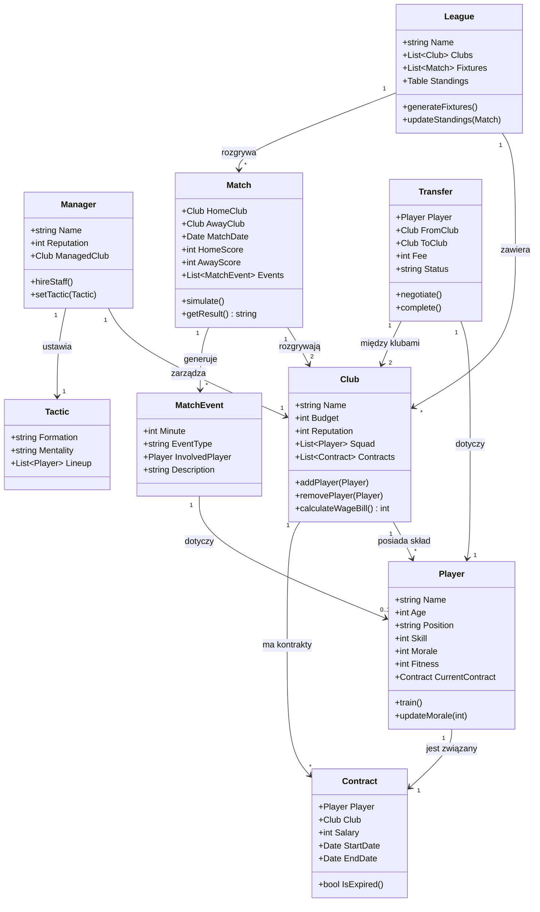
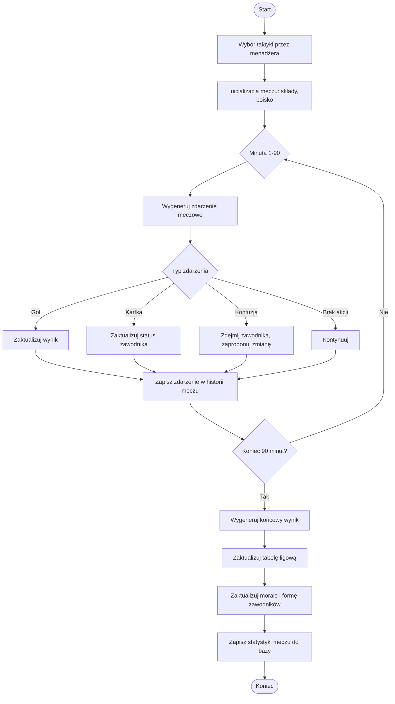
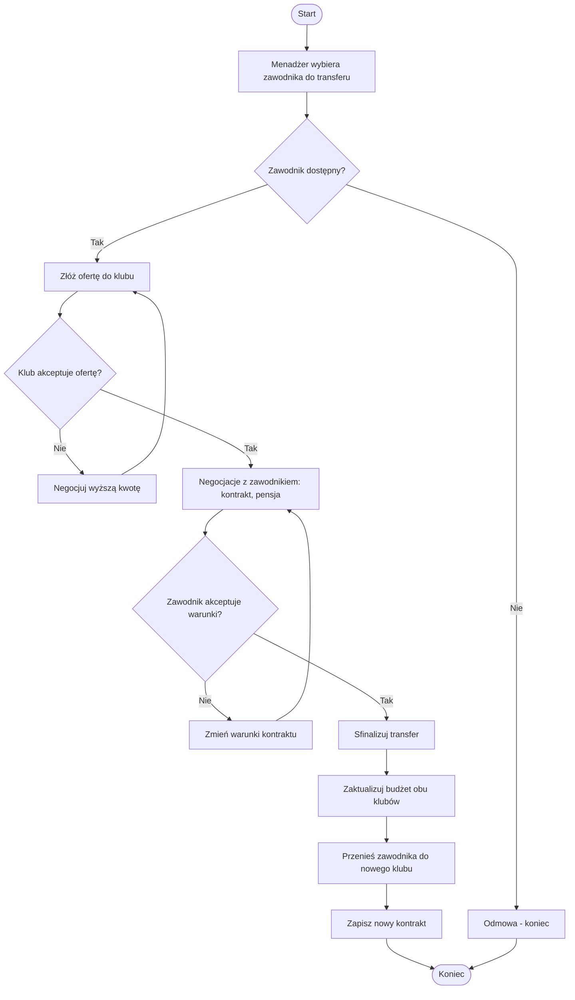

# 📊 Diagramy — Łączność FM

Diagramy w formacie Mermaid — renderują się automatycznie w podglądzie plików `.md` na GitHubie.

---

## 1. Diagram klas

Podstawowy model domenowy gry: menadżer, klub, zawodnik, liga, mecz, transfer i kontrakt.



---

## 2. Diagram aktywności — symulacja meczu

Przepływ jednej rozgrywki meczowej: od wyboru taktyki, przez symulację minut, do zapisania wyniku.



---

## 3. Diagram aktywności — proces transferu zawodnika



---

*Diagramy można edytować bezpośrednio w blokach ```mermaid``` — każdy edytor obsługujący Mermaid (w tym podgląd GitHuba) wyrenderuje je automatycznie.*
